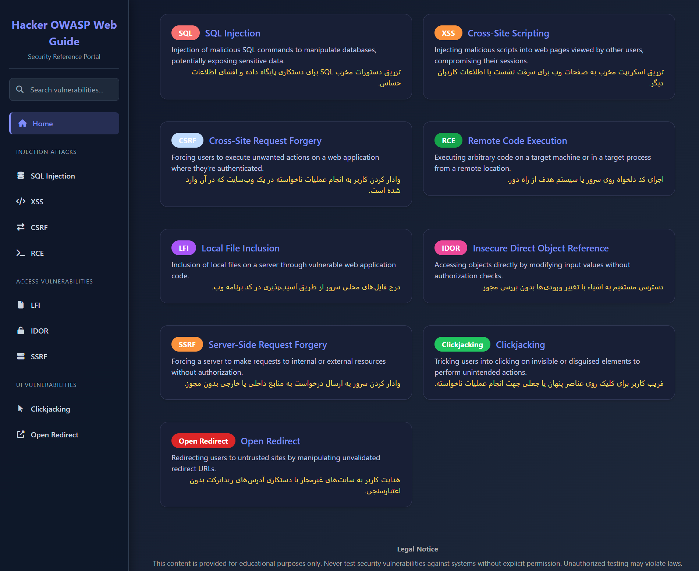

# 🛡️ Chaos Owasp Web Guide — Web Security

## 👀 Site Previews

You can view previews of the site in the `preview` directory as PNG images:




> 🧠 **Maintained by XaocZenon — a comprehensive, visually-rich guide for web application security enthusiasts.**

Welcome! This project is a modern Astro + Tailwind CSS web app focused on practical learning and reference for web application vulnerabilities. It features dark dashboard-inspired UI, Persian (Farsi) translation, RTL layout, and custom font (Vazirmatn).

This guide is designed for:

* Red Teamers and penetration testers
* Blue Teamers and preventions
* Security researchers and students

---

## 🚀 Run the Guide

You can run this guide in two easy ways:

* ✅ **Option 1:** Run locally with Docker
* ✅ **Option 2:** Run online with GitHub Codespaces

---

## 🖥️ Option 1: Run Locally (Using Docker)

### ✅ Requirements

* [Docker Desktop](https://www.docker.com/products/docker-desktop)
* [Git](https://git-scm.com/downloads)

### 🔧 Steps

1. Clone the repository:

   ```bash
   git clone https://github.com/Xaos-meltdown/Chaos-resource-guide.git
   cd Chaos-resource-guide
   ```

2. Build and start the app:

   ```bash
   docker build -t chaos-resource-guide .
   docker run -p 4321:4321 chaos-resource-guide
   ```

3. Open your browser and visit:

   ```
   http://localhost:4321
   ```

---

## ☁️ Option 2: Run in GitHub Codespaces (No Installation Needed)

1. Click the green **`Code`** button on the repository page
2. Select the **`Codespaces`** tab
3. Click **`Create codespace on main`**
4. Once loaded, open the terminal (`Ctrl + ``)
5. Run:

   ```bash
   docker build -t chaos-resource-guide .
   docker run -p 4321:4321 chaos-resource-guide
   ```

6. Use the port preview link to open the app

---

## 📚 What This Guide Covers

* SQL Injection
* XSS
* CSRF
* RCE
* LFI
* IDOR
* SSRF
* Clickjacking
* Open Redirect


All main content is translated to Persian, with proper RTL formatting and the Vazirmatn font for readability.

---

## ⚠️ Disclaimer

> This guide is for educational and research purposes only. Do **not** use any payloads or techniques on systems you do not own or have explicit permission to test. Use responsibly!

---

## 🤝 Want to Contribute?

Contributions, issues, and suggestions are welcome! Open a pull request or issue on GitHub. For Persian security community, feel free to share, translate, or adapt for local training.

---

## 📄 License

This project is licensed under the MIT License. See LICENSE for details.